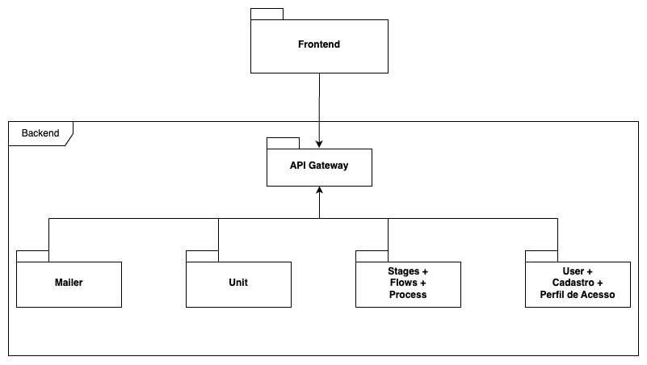

# CAPJu - Config

<div align="center">
  
</div>

## Sobre o Projeto

O CAPJu é abreviação para _"Controle e Acompanhamento de Processos da Justiça"_, no qual trata-se de uma projeto de código aberto que tem como objetivo ajudar os usuários da 4ª vara cível da Justiça Federal na realização de gerenciar os processos.

Este repositório contém as configurações gerais dos serviços, proxy e banco de dados do projeto CAPJu, seguindo uma arquitetura de microserviços e uma estrutura multi-repo. Os repositórios que compõem o back-end do projeto são: [Mailer](https://github.com/fga-eps-mds/2023-2-CAPJu-Mailer-Service), [ProcessManagement](https://github.com/fga-eps-mds/2023-2-CAPJu-ProcessManagement-Service), [Role](https://github.com/fga-eps-mds/2023-2-CAPJu-Role-Service), [Note](https://github.com/fga-eps-mds/2023-2-CAPJu-Note-Service), [Unit](https://github.com/fga-eps-mds/2023-2-CAPJu-Unit-Service), [User](https://github.com/fga-eps-mds/2023-2-CAPJu-User-Service). O repositório de configuração é: [Config](https://github.com/fga-eps-mds/2023-2-CAPJu-Config)

## Tecnologias

<div style="display: flex">


</div>

## Estrutura do repositório

- Serviço de Usuário (User): Serviço destinado a oferecer funcionalidades robustas e escaláveis para gerenciar a autenticação, autorização, listagem e perfis dos usuários.
- Serviço de Unidades (Unit):
- Serviço de Email (Mailer):

## Arquitetura

<div align="center">

</div>

## Instalação
*Obs: Dentro do docker de configuração o nginx, ou proxy, irá apontar erro até todos os serviços do back-end serem levantados*

### Configurando .env

```
POSTGRES_DATABASE=
POSTGRES_PORT=
POSTRES_USER=
POSTGRES_PASSWORD=
```

## Docker
Para rodar esse projeto é necessário ter uma instalação do docker em sua máquina local, para consultar a instalação baseado no seu sistema operacional acesse o [site da instalação](https://docs.docker.com/engine/install/)

## Docker-compose
Para rodar esse projeto é necessário também possuir uma instalação do plugin do docker, docker-compose, em sua máquina, para o sistema operacional Windows a instalação é feita junto ao [Docker Desktop](https://docs.docker.com/compose/install/). Para instalação no sistema operacional linux basta seguir a documentação presente no site através do seguinte [link](https://docs.docker.com/compose/install/linux/#install-the-plugin-manually)

## Execute o projeto localmente

Por conter uma arquitetura de microserviços, para rodar os serviços é necessário rodar primeiramente esse repositório para assim, criar o banco de dados local.

## Rodando serviço
Para rodar o serviço basta apenas rodar o comando: 

```bash
docker-compose up
```

<!-- ## Criando banco de dados

É utilizado um sistema de migrations para mantermos o banco de dados sempre atualizado:

Obs: Para rodar os comandos listados abaixo, é necessário a criação prévia da base de dados que terá o mesmo nome da variável DB_NAME encontrada no .env.

Obs: Pra executar esses comandos, se faz necessário a instalação da sequelize-cli como pacote externo.

```bash
npm install -g sequelize-cli

# Esse comando irá instalar a sequelize-cli de maneira global e irá permitir que você rode comandos com o npx.
```

```bash
npm run migration OU npx sequelize-cli db:migrate

# Esse comando irá rodar as migrations criando as tabelas no seu banco da dados.
```

Caso seja necessário remover a última migration, pode ser usado esse comando:

```bash

npm run shred OU npx sequelize-cli db:migrate:undo

# Esse comando irá remover a última migration criada.
``` -->

### Deployment

[GitHub Actions](https://github.com/fga-eps-mds/2023-1-CAPJu-Services/actions).

## Contribuição

Certifique-se de ler o [Guia de Contribuição](https://github.com/fga-eps-mds/2023-1-CAPJu-Front/blob/main/.github/CONTRIBUTING.md) antes de realizar qualquer atividade no projeto!

## Licença

O CAPJu está sob as regras aplicadas na licença [MIT](https://github.com/fga-eps-mds/2023-1-CAPJu-Front/blob/main/LICENSE)

## Contribuidores

<a href="https://github.com/fga-eps-mds/2023-2-CAPJu-Config/graphs/contributors">
  
  
</a>
